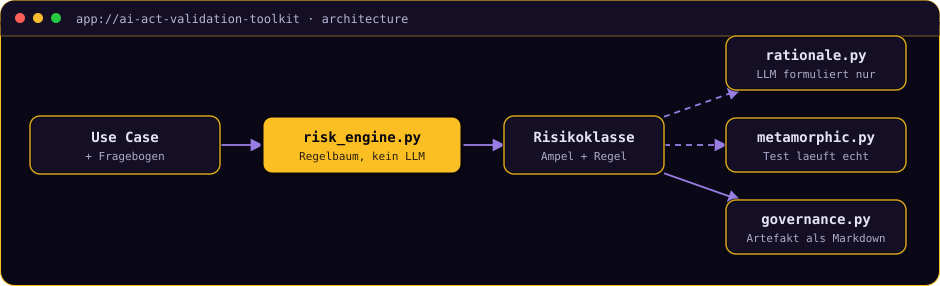

# AI Risk Classifier

**Ordnet eine KI-Anwendung einer EU-AI-Act-Risikoklasse zu und belegt die Methodik mit
einem live ausgeführten metamorphen Test: die Klassifizierung trifft ein
deterministischer Regelbaum, nicht das LLM.**


[](https://ai-act-validation-toolkit.streamlit.app/)

> **▶ [Demo ausprobieren](https://ai-act-validation-toolkit.streamlit.app/)**
> Wähle das Fahrzeug-Komfortsystem, deaktiviere im Fragebogen das Kriterium
> „Sicherheitsbauteil" und beobachte, wie die Ampel live von Hochrisiko auf minimales
> Risiko fällt. Danach den metamorphen Test starten.
> *Streamlit Free Tier: der erste Aufruf kann ein paar Sekunden zum Aufwachen brauchen.*

<!-- TODO(Marco): Screenshot einfuegen, dann diese Zeile durch das Bild ersetzen:
      -->

<details>
<summary><b>🇬🇧 English summary</b></summary>

A tool that classifies a described AI use case into an EU AI Act risk class. The
classification itself is a deterministic rule tree (Annex III), an LLM only phrases the
rationale and cannot influence the outcome. For the automotive use case it runs a real
metamorphic test (temperature monotonicity relation) against a simulated comfort system,
and generates a governance artefact for high-risk cases. A miniature of the author's
doctoral research (KIT/ITIV). Full write-up in German below.
</details>

---

## In 30 Sekunden

Seit dem 2. August 2026 gilt die Enforcement-Pflicht für Hochrisiko-Systeme nach dem EU AI
Act. Dieses Tool sagt dir, ob dein KI-System darunter fällt, und beweist seine Methodik an
einem live ausgeführten Test statt sie nur zu behaupten.

Es ist die anwendbare Miniatur-Version von Marcos Promotionsthema (Dr.-Ing., „Sehr gut",
KIT/ITIV, 2019 bis 2025): „Validierung von KI-Systemen durch Verknüpfung von Szenarien und
metamorphes Testen", erprobt in einer Industriekooperation mit Mercedes-Benz zu autonomen
Fahrzeug-Komfortsystemen.

## Die zentrale Entscheidung: das LLM darf nicht klassifizieren

Bei einem Compliance-Werkzeug ist Nachvollziehbarkeit wichtiger als Sprachgewandtheit. Ein
LLM, das die Risikoklasse selbst bestimmt, wäre bei identischer Eingabe nicht garantiert
reproduzierbar, und genau das ist bei einer Rechtsfrage untragbar. Deshalb steht die Klasse
fest, *bevor* ein LLM überhaupt aufgerufen wird: `risk_engine.py` hat keinerlei
LLM-Abhängigkeit, die Regel-Priorität ist Art. 5 (verboten), dann Art. 6(1)
(Sicherheitsbauteil), dann Art. 6(2) mit Annex III inklusive der Art.-6(3)-Ausnahme, dann
Art. 50 (Transparenz), sonst minimal.

Das LLM bekommt das fertige Ergebnis nur zur Übersetzung in Prosa gereicht. Fällt es aus,
weil das Netzwerk weg ist, der Key ungültig oder das Rate-Limit erreicht, zeigt die App
einen Hinweis statt eines Absturzes und erzeugt das Governance-Artefakt trotzdem, mit
einem Fallback-Text aus der deterministischen Regel.

<details>
<summary><b>▸ Deep Dive: der metamorphe Test und warum er die eigentliche Demo ist</b></summary>

Bei KI-Systemen gibt es das Orakel-Problem: Für eine einzelne Ausgabe ist oft unbekannt,
was „richtig" gewesen wäre. Metamorphes Testen umgeht das, indem es nicht eine Ausgabe
prüft, sondern eine *Beziehung* zwischen zwei Ausgaben. Hier: Steigt die Außentemperatur
bei sonst gleichen Bedingungen, darf die Ziel-Kühlintensität des simulierten
Komfortsystems nicht sinken. Das ist exakt das Prinzip aus der Promotion, reduziert auf
einen konkret ausführbaren Fall.

Der aussagekräftigste Test ist `test_broken_sut_fails_relation` in
`tests/test_metamorphic.py`: Eine absichtlich falsch konstruierte Systemfunktion wird gegen
dieselbe Relation geprüft und *muss* durchfallen. Ohne diesen Test wäre ein „BESTANDEN"
wertlos, denn er beweist, dass der Runner echte Verletzungen erkennt und nicht einfach
immer grün zeigt.

Alle 17 Tests laufen ohne Netzwerk und ohne LLM-Zugriff, kein Mock ersetzt echtes
Verhalten. Die Zuordnung jedes Fragebogen-Kriteriums zur jeweiligen Rechtsgrundlage steht
in [`docs/annex3-mapping.md`](docs/annex3-mapping.md).
</details>

## Architektur



Bewusst schlank gehalten: kein Frontend-Framework, keine Datenbank, keine Vektor-DB. Die
Methodik aus Regelbaum und metamorphem Test soll im Vordergrund stehen, nicht die
Infrastruktur.

## Was es kann, und was nicht

Drei fest hinterlegte Beispiel-Use-Cases decken die Bandbreite der Risikoklassen ab:

| Use Case | Risikoklasse | Regel | Metamorpher Test |
|---|---|---|---|
| Autonomes Fahrzeug-Komfortsystem | Hochrisiko | Art. 6(1), Sicherheitsbauteil | ausgeführt |
| KI-gestützte Bewerber-Vorauswahl | Hochrisiko | Art. 6(2) + Annex III | nein |
| Kundenservice-Chatbot | Begrenztes Risiko | Art. 50, Transparenzpflicht | nein |

**17 Tests**, ohne Netzwerk oder LLM lauffähig.

**Was dieses Projekt nicht ist:** Es liefert keine rechtsverbindliche Compliance-Aussage
und ersetzt weder juristische Beratung noch ein echtes Konformitätsbewertungsverfahren. Es
kennt nur die drei hinterlegten Use Cases, keinen Freitext-Import. Und es führt genau eine
metamorphe Relation aus (Monotonie), nicht die volle Szenario-Verknüpfungsmethodik der
Promotion. Klassische ML-Metriken wie F1 gibt es hier nicht und wären auch sinnlos: Der
Regelbaum ist deterministisch, seine Korrektheit ist eine Frage der Rechtsauslegung, nicht
der Statistik.

## Selbst ausprobieren

Einmalig: `python -m venv .venv` und `.venv/Scripts/python.exe -m pip install -e ".[dev]"`.

```bash
cp .env.example .env                          # LLM_PROVIDER, LLM_MODEL, API-Key eintragen
.venv/Scripts/python.exe -m pytest tests/ -v  # 17 Tests, ohne Netzwerk
.venv/Scripts/python.exe -m streamlit run app.py
```

---

```console
marco@portfolio:~$ open marco-os --project ai-act-validation-toolkit
```

**[▸ Dieses Projekt in MARCO.OS öffnen](https://maggostang-droid.github.io/marco-os/#ai-act-validation-toolkit)**,
dem interaktiven Portfolio von Marco Stang.

**Schwesterprojekte:**
[SQL Copilot](https://github.com/maggostang-droid/sql-copilot) (LangGraph-Agent mit Guardrails) ·
[Review Risk Predictor](https://github.com/maggostang-droid/review-risk-predictor) (erklärbares ML, React/FastAPI) ·
[Ask-Marco Assistant](https://github.com/maggostang-droid/ask-marco-assistant) (Chat über alle Projekte)

<sub>Marco Stang · Dr.-Ing. · [LinkedIn](https://www.linkedin.com/in/marco-stang) · stang.marco@t-online.de · MIT-Lizenz</sub>
