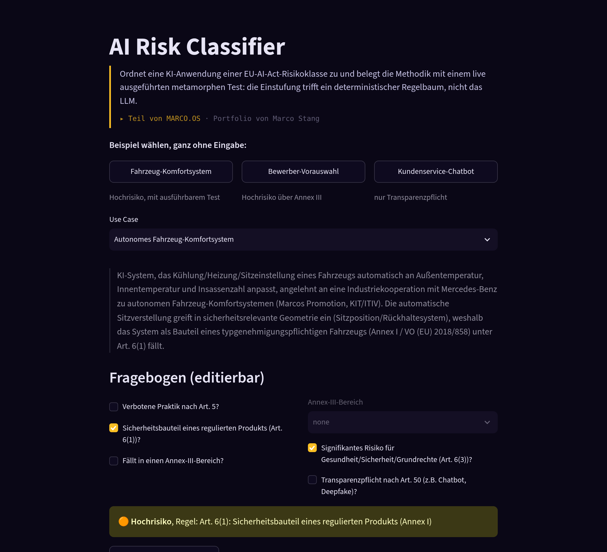
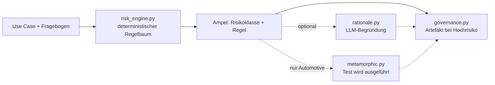

# AI Risk Classifier

Portfolio-Projekt von Marco Stang für Bewerbungen auf AI/KI-Rollen (ggf.
auch KI-Transformations-Rollen).

<!-- TODO(Marco): Screenshot der Demo hier einfügen:
      -->

🔗 **[Projektseite](https://maggostang-droid.github.io/ai-risk-classifier/)**
— Überblick, Architektur, Motivation (kein Ersatz für die Live-Demo, siehe
unten).

## In 30 Sekunden

Dieses Tool sagt dir, ob dein KI-System nach dem EU AI Act als "Hochrisiko"
gilt — und beweist das an einem live ausgeführten Test, statt nur zu
behaupten. Ab dem 2. August 2026 gilt die Enforcement-Pflicht für
High-Risk-Systeme nach dem EU AI Act.

Es ist eine anwendbare Miniatur-Version von Marcos Promotionsthema
(Dr.-Ing., "Sehr gut", KIT/ITIV, 2019–2025): "Validierung von KI-Systemen
durch Verknüpfung von Szenarien und metamorphes Testen", erprobt in einer
Industriekooperation mit Mercedes-Benz zu autonomen
Fahrzeug-Komfortsystemen. Kein anderes Portfolio-Projekt kombiniert eine
einschlägige Promotion mit einem akut zeitrelevanten
Governance-/Compliance-Use-Case — das ist der Grund, warum dieses Projekt
zuerst gebaut wurde.

## Live-Demo

👉 **[ai-act-validation-toolkit.streamlit.app](https://ai-act-validation-toolkit.streamlit.app/)**

(Streamlit Community Cloud — Free-Tier-Apps schlafen nach Inaktivität ein,
der erste Aufruf kann ein paar Sekunden zum Aufwachen brauchen.)

## Was das Tool macht

1. **Klassifizieren.** Ordnet einen beschriebenen KI-Use-Case per
   deterministischem Regelbaum einer EU-AI-Act-Risikoklasse zu (Annex
   III) — editierbarer Fragebogen, keine Blackbox-Klassifizierung. Ändert
   man ein Attribut, wird sofort neu klassifiziert.
2. **Begründen.** Lässt ein LLM nur die Begründung in Klartext
   formulieren, nicht die Klassifizierung selbst — die Risikoklasse steht
   bereits fest, bevor das LLM überhaupt aufgerufen wird.
3. **Verifizieren.** Führt für den Automotive-Use-Case einen echten
   metamorphen Test aus (Temperatur-Monotonie-Relation) gegen ein
   simuliertes Komfortsystem — mit echten Zahlen, nicht nur behauptet.
4. **Dokumentieren.** Generiert für Hochrisiko-Fälle ein
   Governance-Artefakt (Risk Assessment + Konformitätscheckliste nach
   Art. 9–15) als Markdown, in-App lesbar und als Download.

## Beispiel-Use-Cases

Drei fest hinterlegte Beispiele zeigen die Bandbreite der Risikoklassen
(Details/Rechtsgrundlagen: [`docs/annex3-mapping.md`](docs/annex3-mapping.md)):

| Use Case | Risikoklasse | Regel | Metamorpher Test |
|---|---|---|---|
| Autonomes Fahrzeug-Komfortsystem | 🟠 Hochrisiko | Art. 6(1) — Sicherheitsbauteil eines regulierten Produkts | ✅ ausgeführt |
| KI-gestützte Bewerber-Vorauswahl | 🟠 Hochrisiko | Art. 6(2) + Annex III (Beschäftigung) | — |
| Kundenservice-Chatbot | 🔵 Begrenztes Risiko | Art. 50 — Transparenzpflicht | — |

Der Fragebogen ist in der App für jeden Use Case editierbar — man kann
z.B. beim Komfortsystem das Kriterium "Sicherheitsbauteil" deaktivieren
und live beobachten, wie die Klasse auf 🟢 Minimales Risiko fällt.

## Wie es funktioniert



- **Klassifizierung ist deterministisch, nicht das LLM.** `risk_engine.py`
  hat keinerlei LLM-Abhängigkeit — die Regel-Priorität ist Art. 5
  (verboten) → Art. 6(1) (Sicherheitsbauteil) → Art. 6(2)+Annex III (mit
  Art.-6(3)-Ausnahme) → Art. 50 (Transparenz) → minimal. Ein LLM bekommt
  das fertige Ergebnis nur zur Übersetzung in Prosa gereicht und kann die
  Klasse nicht mehr beeinflussen.
- **Der metamorphe Test ist die eigentliche Methodik-Demo.** Statt eine
  einzelne Ausgabe gegen ein unbekanntes "richtiges" Ergebnis zu prüfen
  (das Orakel-Problem bei KI-Systemen), prüft er eine *Beziehung*
  zwischen zwei Ausgaben: steigt die Außentemperatur bei sonst gleichen
  Bedingungen, darf die Ziel-Kühlintensität des simulierten
  Komfortsystems nicht sinken. Das ist exakt das Prinzip aus der
  Promotion, hier auf einen konkret ausführbaren Fall reduziert.
- **Das Governance-Artefakt bleibt auch ohne LLM verfügbar.** Fällt die
  LLM-Begründung aus (kein Netzwerk, ungültiger Key, Rate-Limit), zeigt
  die App einen Fehlerhinweis statt eines Absturzes und generiert das
  Artefakt trotzdem — mit einem Fallback-Begründungstext basierend auf
  der deterministischen Regel. Klassifizierung, Konformitätscheckliste
  und metamorpher Test stammen ohnehin nicht vom LLM.

## Architektur

- `src/ai_act_toolkit/risk_engine.py` — deterministischer Annex-III-Regelbaum
- `src/ai_act_toolkit/use_cases.py` — 3 Beispiel-Use-Cases
- `src/ai_act_toolkit/comfort_system_sut.py` — Toy-Komfortsystem + Monotonie-Relation
- `src/ai_act_toolkit/metamorphic.py` — generischer metamorpher Test-Runner
- `src/ai_act_toolkit/governance.py` — Governance-Artefakt-Generator
- `src/ai_act_toolkit/llm.py` / `rationale.py` — provider-agnostische
  LLM-Anbindung (LangChain `init_chat_model`, gesteuert über
  `LLM_PROVIDER`/`LLM_MODEL`) + Begründungstext
- `app.py` — Streamlit-UI

## Tech-Stack

| Bereich | Technologie | Zweck |
|---|---|---|
| Sprache | Python ≥ 3.10 | gesamtes Package + App |
| LLM-Anbindung | [LangChain](https://python.langchain.com/) (`init_chat_model`) + `langchain-anthropic` / `langchain-openai` | provider-agnostisch, Wahl über `.env` (`LLM_PROVIDER`/`LLM_MODEL`), kein hartcodiertes Modell |
| UI | [Streamlit](https://streamlit.io/) | Fragebogen, Ampel-Klassifizierung, metamorpher Test, Governance-Download |
| Tests | [pytest](https://pytest.org/) | 17 Tests, kein Netzwerk/LLM nötig — inkl. `streamlit.testing.v1.AppTest` zur UI-Verifikation ohne Browser |
| Konfiguration | [python-dotenv](https://pypi.org/project/python-dotenv/) | `.env`-basierte Secrets, nichts hartcodiert |
| Packaging | setuptools (src-Layout, editable install) | `pip install -e ".[dev]"` |
| Demo-Hosting | [Streamlit Community Cloud](https://streamlit.io/cloud) | kostenlose Live-Demo direkt aus dem GitHub-Repo |
| Projektseiten-Hosting | [GitHub Pages](https://pages.github.com/) | `docs/index.html`, kein externes CDN, self-contained |

Kein Frontend-Framework, keine Datenbank, keine Vektor-DB — bewusst
schlank gehalten, damit die Methodik (Regelbaum + metamorpher Test) im
Vordergrund steht statt Infrastruktur.

## Quickstart

Einmalig: `python -m venv .venv` und
`.venv/Scripts/python.exe -m pip install -e ".[dev]"`. Danach:

```bash
cp .env.example .env                          # LLM_PROVIDER/LLM_MODEL/API-Key eintragen
.venv/Scripts/python.exe -m pytest tests/ -v  # 17 Tests, ohne Netzwerk/LLM
.venv/Scripts/python.exe -m streamlit run app.py
```

## Tests

17 Tests, `pytest tests/ -v` läuft komplett **ohne Netzwerk- oder
LLM-Zugriff** (die Klassifizierung ist deterministisch, der metamorphe
Test läuft gegen eine lokale Toy-Funktion). Kein Mock ersetzt echtes
Verhalten — jeder Test ruft die tatsächliche Logik auf.

Der aussagekräftigste Test ist `test_broken_sut_fails_relation`
(`tests/test_metamorphic.py`): eine absichtlich falsch konstruierte
Systemfunktion wird gegen dieselbe Monotonie-Relation getestet und muss
als *fehlgeschlagen* erkannt werden. Ohne diesen Test wäre ein "BESTANDEN"
nicht aussagekräftig — er beweist, dass der Runner echte Verletzungen
erkennt und nicht einfach immer grün anzeigt.

## Weiterführende Dokumentation

- [`docs/annex3-mapping.md`](docs/annex3-mapping.md) — jedes
  Fragebogen-Kriterium der jeweiligen Rechtsgrundlage im EU AI Act
  zugeordnet
- [`docs/superpowers/specs/`](docs/superpowers/specs/) — Design-Spec mit
  allen Architekturentscheidungen
- [`docs/superpowers/plans/`](docs/superpowers/plans/) — Implementierungsplan
  (10 Tasks, inkl. vollständigem Code pro Task)
- [`HANDOVER.md`](HANDOVER.md) — Projektstatus + bekannte offene Punkte,
  gedacht für den Wiedereinstieg ohne vorherigen Kontext

## Limitierungen

- Keine rechtsverbindliche Compliance-Aussage, kein Ersatz für juristische
  Beratung oder ein echtes Konformitätsbewertungsverfahren.
- Nur 3 fest hinterlegte Beispiel-Use-Cases, kein Freitext-Import.
- Ein metamorpher Test (Monotonie-Relation), nicht die volle
  Szenario-Verknüpfungsmethodik der Promotion.

## Portfolio-Kontext

Dieses Projekt ist Teil von **[MARCO.OS](https://maggostang-droid.github.io/marco-os/)**,
dem interaktiven Portfolio von Marco Stang — dort lässt sich diese Demo
direkt im Projektfenster ausprobieren. Schwesterprojekte:

- [SQL Copilot](https://github.com/maggostang-droid/sql-copilot) — LangGraph-Agent für Text-to-SQL mit Guardrails und Selbstkorrektur
- [Review Risk Predictor](https://github.com/maggostang-droid/review-risk-predictor) — erklärbare ML-Risikovorhersage (React/FastAPI)
- [Ask-Marco Assistant](https://github.com/maggostang-droid/ask-marco-assistant) — Chat, der alle Portfolio-Projekte kennt (Context-Stuffing + MCP-Server)
